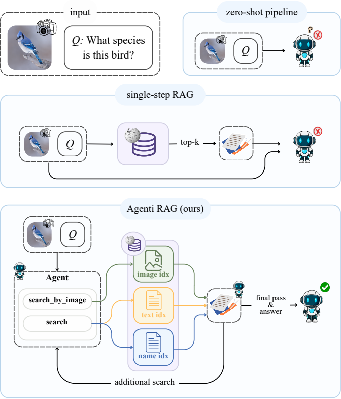

# Deciding When to Retrieve: Agentic and Gated Retrieval for Encyclopedic VQA

**Isabella Cappellino, Marin Cervinschi** — University of Modena and Reggio Emilia

Course project for Computer Vision and Cognitive Systems, 2026. Unpublished; the
write-up is in `outputs/paper/` and is not tracked here.

<p align="center"></p>

We reach a Wikipedia knowledge base through three channels — image similarity,
entity-name resolution, and lexical search over article text — and study how the
decision to use them should be made. Two mechanisms are compared against the same
single-step baseline: an agentic loop that writes its own queries, and a
deterministic gate that reads a cross-encoder score the pipeline has already
computed. The loop is worth +5.0 BEM; the gate recovers +4.0 of that with no
agent and no extra generation.

**Every number in the write-up maps to a command in [`REPRODUCE.md`](REPRODUCE.md),
and each of those commands has been re-run and checked.**

## Requirements

- A SLURM cluster with the `cvcs2026` account and a 45 GB GPU (A40 or L40S).
- [`uv`](https://docs.astral.sh/uv/) on `PATH`. The project and scoring
  environments are synced on first run.
- Shared assets under `/work/cvcs2026/`:
  - `hf_cache/` with Qwen3-VL-8B, EVA-CLIP-8B and
    `bge-reranker-v2-m3` (add more with `scripts/setup/download_model.sh <hf-id>`).
  - `encyclopedic/` with `knn.index`, `knn.json`, `encyclopedic_kb_wiki.db` and
    `encyclopedic_test_subset.json`.

The knowledge base and the visual index are not redistributable. The index comes
from ReAG; the knowledge base is built from the Encyclopedic-VQA release with
`scripts/setup/build_kb_sqlite.sh`.

## Running an experiment

Always submit through `scripts/submit.sh`. It snapshots the tree into `runs/<id>/`
and points the job at that snapshot, so a queued job runs what you submitted and a
past run can be reproduced from its own code rather than from `HEAD`:

```bash
scripts/submit.sh scripts/run_abc.sh                 # A, B and C on one server
SMOKE=1 scripts/submit.sh scripts/run_abc.sh --time=00:40:00   # 5 examples first
```

Every knob is an environment variable, so a variant is a submit line and not an
edit:

```bash
TEXT_GATE= scripts/submit.sh scripts/run_abc.sh                    # gate off
ARMS="A B Bplus Btext Bgated" scripts/submit.sh scripts/baselines/run_b.sh
ORACLE=1 ARMS="Bgated" scripts/submit.sh scripts/baselines/run_b.sh
```

The arm the paper calls **Gate only** is `Bgated` in the code and in the output
filenames; it predates the renaming and we left it alone so that existing results
stay addressable.

Each run writes predictions, a `.meta.json` recording the exact command, the node
and the GPU, and a `results_*.json` with per-example scores next to it. The paired
tests in the paper are computed from those per-example scores:

```bash
uv run python src/ablation/compare_runs.py <ref>.scores.jsonl <other>.scores.jsonl
```

## Layout

```
src/agent/          the agentic pipeline: two tools, the gate, the final pass
src/vlm/            the single-step pipeline (A, B, Bplus, Btext, Gate only)
src/retrieval/      the three indices, ranking strategies, the SQLite knowledge base
src/retrieval/experiments/   channel-level measurements (recall, fusion, the gate probe)
src/ablation/       paired significance tests and the paper figures
scripts/            SLURM launchers, one per experiment
```

`outputs/`, `runs/` and `logs/` are gitignored: they are ours, not part of the
release.

## Data

`encyclopedic_kb_wiki.db` (~24 GB) holds ~2.0M articles in `articles` (url, title)
and their text in `paragraphs`, plus two derived tables that turn an entity *name*
into an article:

- **`aliases`** (`alias`, `url`) — surface forms derived from each title: the
  normalised title, the title without a parenthetical qualifier, and both without
  a leading article. Two to four forms per article, no synonyms and no redirects.
- **`titles_fts`** — an FTS5 index over title tokens, used only as a fuzzy fallback.

Matching is string matching, deliberately not embeddings: the EVA-CLIP text tower
is misaligned with the image index and returns near-zero recall even when given
the ground-truth title. Given the gold title this lookup reaches **83.3%** of
articles, which is a ceiling on the name channel.

Rebuild the derived tables on an existing database with `--index-only`, which
takes seconds instead of re-ingesting the source JSON.
